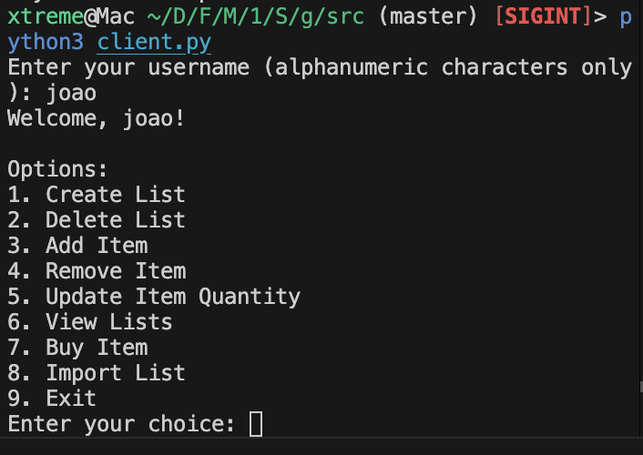

# SDLE First Assignment

SDLE First Assignment of group T04G13.

Group members:

1. João Sousa (up202106996@up.pt)
2. José Oliveira (up202108764@up.pt)
3. Alexandre Correia (up202007042@up.pt)

## How to run

### Prerequisites

1. Install [python](https://www.python.org/downloads/) (make sure to download Python 3.x).

2. Install the required libraries for the project:

```bash
$ cd src
$ pip3 install -r requirements.txt
```

### Running the Project

1. Start the Proxy:

Open a terminal, navigate to the src directory, and run the startup script to initialize the server processes:

```bash
$ ./startup.sh
```

2. Run the Client:

Open additional terminals (one for each client) and start the client program. You can run as many clients as needed:

```bash
$ python3 client.py
```

3. Interact with the Client:

<li>
Enter a username when prompted.
</li>
<li>
Follow the on-screen instructions to use the client features.
</li>

### Interface

Below is a preview of the client interface:



